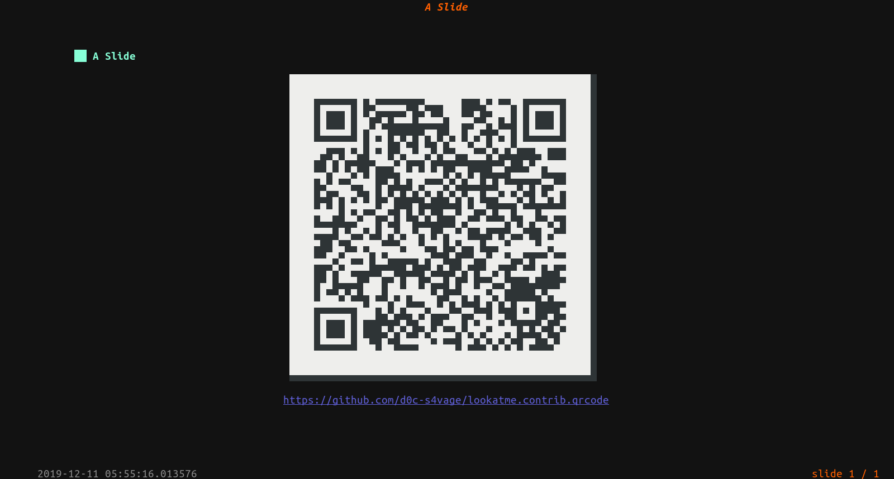

[](https://travis-ci.org/d0c-s4vage/lookatme.contrib.qrcode)
[](https://coveralls.io/github/d0c-s4vage/lookatme.contrib.qrcode?branch=master)
[](https://pypistats.org/packages/lookatme.contrib.qrcode)
[](https://pypi.python.org/pypi/lookatme.contrib.qrcode/)
[](https://lookatmecontribqrcode.readthedocs.io/en/latest/?badge=latest)

[](https://twitter.com/d0c_s4vage)

# lookatme.contrib.qrcode

This [lookatme](https://github.com/d0c-s4vage/lookatme) extension adds
QR code rendering capabilities to the code blocks.

## Installation

If this project has been pushed up to pypi:

```bash
pip install lookatme.contrib.qrcode
```

otherwise:

```bash
pip install ./path/to/lookatme.contrib.qrcode
```

## Usage

Add the qrcode into the extensions array in the
slide YAML header:

```markdown
---
title: A title
author: Me
date: 2019-12-04
extensions:
  - qrcode
---
```

### Basic Usage

With the extension installed and declared in the YAML header, use it in your
markdown like so:

~~~md
# A Slide

```qrcode
https://github.com/d0c-s4vage/lookatme.contrib.qrcode
```
~~~



### Extended Usage

An [extended mode](https://lookatmecontribqrcode.readthedocs.io/en/latest/#qrcode-ex-codeblocks)
is also available that lets multiple columns of QR codes be rendered side-by-side:

~~~md
# A Slide

```qrcode-ex
columns:
  - data: https://github.com/d0c-s4vage/lookatme
    caption: "**lookatme** project"
  - data: https://github.com/d0c-s4vage/lookatme.contrib.qrcode
    caption: Text `lookatme.contrib.qrcode`
```
~~~


### Details

[Read the documentation](https://lookatmecontribqrcode.readthedocs.io/en/latest/)
