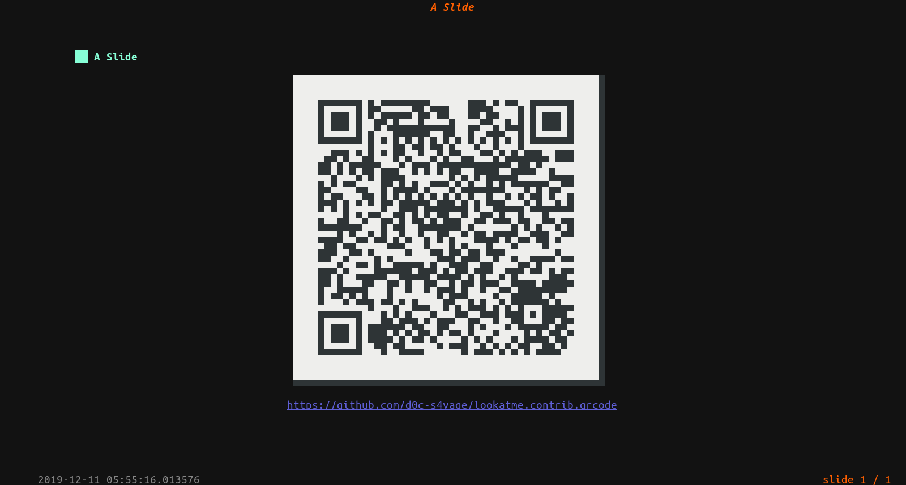
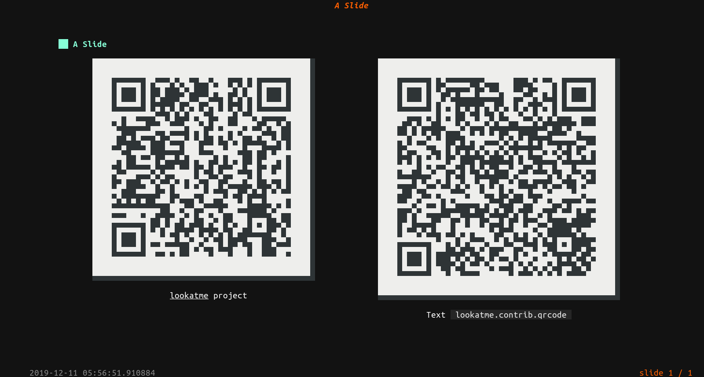

.. lookatme.contrib.qrcode documentation master file, created by
   sphinx-quickstart on Tue Dec 10 21:34:16 2019.
   You can adapt this file completely to your liking, but it should at least
   contain the root `toctree` directive.

lookatme.contrib.qrcode
=======================

This `lookatme <https://github.com/d0c-s4vage/lookatme>`_ extension adds
QR code rendering support to codeblocks within a presentation. If a codeblock
sets its language as either ``qrcode`` or ``qrcode-ex``, this extension will
handle rendering the codeblock.

Setup
-----

Install this extension with:

.. code-block:: bash

    pip install lookatme.contrib.qrcode

Declare that it should be loaded and used in your slides' header:

.. code-block:: md

    ---
    title: Slide title
    extensions:
      - qrcode
    ---

    # First Slide Header

``qrcode`` Codeblocks
---------------------

If the language is set to ``qrcode``, the data contained within the codeblock
will be converted directly to a qrcode, with the caption being automatically
set to the codeblock's value.

.. code-block:: md

    # A Slide

    ```qrcode
    https://github.com/d0c-s4vage/lookatme.contrib.qrcode
    ```

The markdown above is rendered as the qrcode below:



``qrcode-ex`` Codeblocks
------------------------

If the language is set to ``qrcode-ex``, the data contained within the codeblock
must YAML data that matches the schema :any:`QrSchema`. The YAML data defines
the colums of QR codes to display and their captions:

.. code-block:: yaml

    columns:
      - data: REQUIRED
        autocaption: true # default
        caption: null # default

.. code-block:: md

    # A Slide

    ```qrcode-ex
    columns:
      - data: https://github.com/d0c-s4vage/lookatme
        caption: "**lookatme** project"
      - data: https://github.com/d0c-s4vage/lookatme.contrib.qrcode
        caption: Text `lookatme.contrib.qrcode`
    ```

The markdown above is rendered as the qrcode below:




.. toctree::
    :maxdepth: 2
    :caption: Contents:

    autodoc/modules


Indices and tables
==================

* :ref:`genindex`
* :ref:`modindex`
* :ref:`search`
